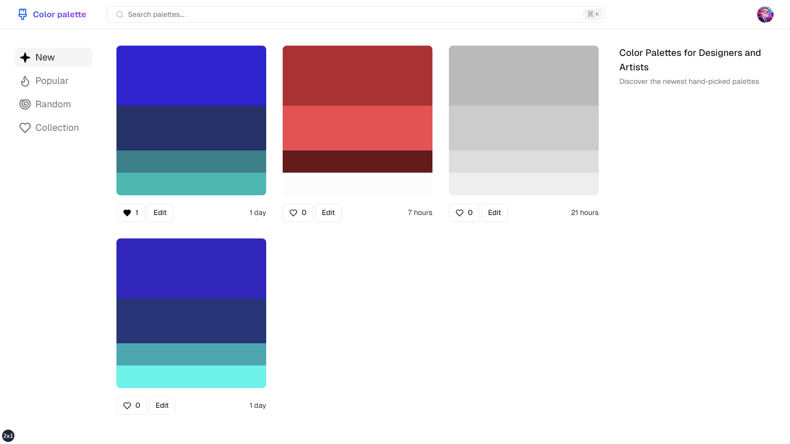

# [Color palette](https://color-palette-gamma.vercel.app)

This is an open source color palette website build with everything new in Next.js 14. It is bootstrapped with `create-t3-app`.

[](https://color-palette-gamma.vercel.app)

## Tech Stack

- **Framework:** [Next.js](https://nextjs.org)
- **Styling:** [Tailwind CSS](https://tailwindcss.com)
- **User Management:** [NextAuth](https://next-auth.js.org)
- **Database (KV)** [Redis](https://upstash.com/)
- **UI Components:** [shadcn/ui](https://ui.shadcn.com)

## Features to be implemented

- [x] Authentication with **NextAuth**
- [x] Database with **Redis**
- [x] Validation with **Zod**
- [x] Palette creation
- [x] Palette creation based on other ones
- [x] Palette tags and likes
- [x] Tag-based searching
- [x] Personal palette collection and sharing
- [x] Secure data layer (server-only code) and server actions, middleware

## Running Locally

1. Clone the repository

   ```bash
   git clone https://github.com/iboughtbed/color-palette.git
   ```

2. Install dependencies using pnpm

   ```bash
   pnpm install
   ```

3. Copy the `.env.example` to `.env` and update the variables.

   ```bash
   cp .env.example .env
   ```

4. Start the development server

   ```bash
   pnpm run dev
   ```

## How do I deploy this?

Follow the deployment guides for [Vercel](https://create.t3.gg/en/deployment/vercel), [Netlify](https://create.t3.gg/en/deployment/netlify) and [Docker](https://create.t3.gg/en/deployment/docker) for more information.

## Development process

### Design and Data Flow

Before starting development, I created a comprehensive design and data flow for the system. This included outlining the user interface, database schema, and interaction between different components of the application.

### Methodology

Throughout the development process, I followed a structured approach, breaking down tasks into manageable chunks and prioritizing them based on their importance and dependencies. I also made sure to regularly review and iterate on the design and implementation to ensure alignment with the project goals.

### Unique Approaches

One unique aspect of my approach is my ability to think and code quickly. This allowed me to efficiently implement features and iterate on them as needed.

### Compromises and Challenges

Creating the tag-based palette search menu was tough due to school time constraints. Spent about 4 hours refining it.
I wanted to add a dropdown menu for the search bar, but it didn't work as expected, instead ended up using dialog menu.

Another small issue was implementing optimistic updates on server actions. Spent 30-40 minutes on it initially but decided not to use it in the final version.

I also considered using Prisma, but ended up using Redis because of the speed advantage

#### Known Issues

No major issues with the app at the moment. I'll keep an eye out for any problems during development and testing.

#### Notes: I'm a student at Nazarbayev Intellectual School in 10th grade and typically study from 8:00 AM to 6:00 PM. Had some issues with time management

## License

Licensed under the MIT License. Check the [LICENSE](./LICENSE) file for details.
